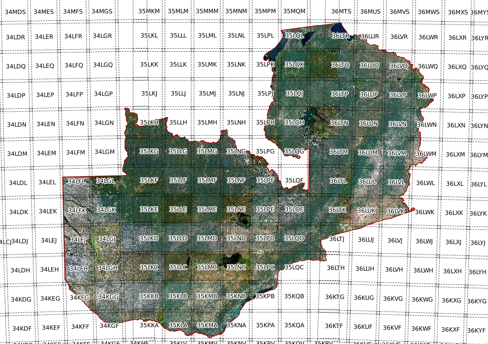

.. sen2mosaic documentation master file, created by
   sphinx-quickstart on Tue Sep 19 16:00:25 2017.
   You can adapt this file completely to your liking, but it should at least
   contain the root `toctree` directive.
   Setup assisted by https://samnicholls.net/2016/06/15/how-to-sphinx-readthedocs/

Welcome to sen2mosaic's documentation!
======================================

This is a set of tools to aid in the production of large-scale cloud-free seasonal mosaic products from Sentinel-2 data.

Building cloud-free mosaics of Sentinel-2 data for land cover mapping is difficult, with existing tools still under-development and hard to use. The goal of these tools to streamline this processing chain with a set of straightforward command line tools.

This repository contains four command-line based scripts to perform the following tasks:

* Downloading Sentinel-2 data from the `Copernicus Open Access Hub <https://scihub.copernicus.eu/>`_ for a particular tile, specifying date ranges and degrees of cloud cover. This is based on the `Sentinelsat <https://github.com/sentinelsat/sentinelsat/>`_ utility.
* Executing the `sen2cor <http://step.esa.int/main/third-party-plugins-2/sen2cor/>`_ tool to perform atmospheric correction, and performing simple improvements to its cloud mask.
* Mosaicking cloud-free Sentinel-2 pixels from .SAFE files into larger GeoTIFF files that are suitable for image classification.

How do I get set up?
--------------------

These tools are written in Python for use in Linux. You will need to have first successfully installed the following:

* `Sentinelhub <https://github.com/sinergise/sentinelhub>`_: A library for searching and downloading Sentinel-2 products.
* `Sen2cor <http://step.esa.int/main/third-party-plugins-2/sen2cor/>`_: Atmospheric correction and cloud masking for Sentinel-2.

The sen2cor tool is built around the `Anaconda <https://www.anaconda.com/download/>`_ distribution of Python. The modules used in these scripts are all available in Anaconda Python.

Who do I talk to?
-----------------

Written and maintained by Samuel Bowers (`sam.bowers@ed.ac.uk <mailto:sam.bowers@ed.ac.uk>`_).

See also
--------

We have also developed a very similar tool to produce mosaics of Sentinel-1 C-band radar backscatter data. See `sen1mosaic <https://bitbucket.org/sambowers/sen1mosaic>`_.

Contents:
---------

.. toctree::
   :numbered:
   :maxdepth: 2

   setup.rst
   command_line.rst
   worked_example.rst
   sen2mosaic.rst

Indices and tables
==================

* :ref:`genindex`
* :ref:`modindex`
* :ref:`search`
