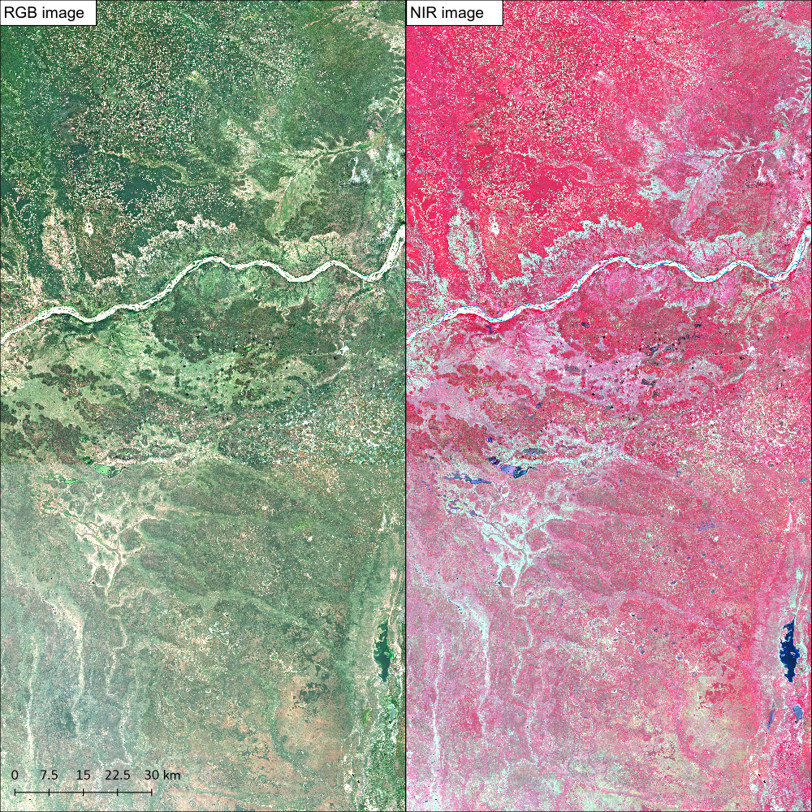

.. _worked_example_commandline:

Worked example on the command line
==================================

Here we'll show you by example how the sen2mosaic processing chain works in practice. We will focus on an example from southern Mozambique, with the aim of creating a cloud-free composite GeoTiff product for the area **500,000 - 600,000** m Eastings and **7,500,000 - 7,700,000** m Northings (**UTM 36S**). This area is covered by Sentinel-2 tiles **36KWA** and **36KWB**. We'll limit this mosaic to the early dry season (**May and June**) of **2017**, in anticipation of multiple seasonally-specific mosaics improving classification accuracy.

Preparation
-----------

First ensure that you've followed :ref:`setup` successfully.

Open a terminal, and use ``cd`` to navigate to the location you'd like to store data.

.. code-block:: console
    
    cd /home/user/DATA
    mkdir worked_example
    cd worked_example

Use mkdir to make a separate folder for each of the granules you intend to download.

.. code-block:: console
    
    mkdir 36KWA
    mkdir 36KWB
    
Here we'll demonstrate the process for the tile 36KWA. We'll leave 36KWB for you to do without guidance.

To begin, navigate to the 36KWA folder.

.. code-block:: console
    
    cd 36KWA

Downloading data
----------------

The first step is to download Sentinel-2 level 1C data from the `Copernicus Open Access Data Hub <https://scihub.copernicus.eu/>`_.

For this we use the ``L1C.py`` tool. We will need to specify a Scihub username and password (sign up for an account at `Scihub <https://scihub.copernicus.eu/>`_), the tile to download, a start and end date in the format YYYYMMDD, and a maximum degree of cloud cover to download. For the purposes of this demonstration, we'll set maximum cloud cover to 30 %.

These options can be encoded as follows:

.. code-block:: console
    
    s2m download -u user.name -p supersecret -t 36KWA -s 20170501 -e 20170630 -c 30

As we didn't specify the option ``-o`` (``--output``), data will output to the current working directory. We also didn't include the ``-r`` (``--remove``) flag, meaning that intermediate .zip files downloaded from the internet won't be deleted. This can quickly result in large volumes of data building up, so if you're limited by disk space use the ``-r`` flag.

Wait for all files to finish downloading before proceeding to the next step. By the time the processing is complete, your ``36KWA/`` directory should contain the following files (show files in the currenty working directory with the command ``ls``).

.. code-block:: console
    
    S2A_MSIL1C_20170506T074241_N0205_R049_T36KWA_20170506T075325.SAFE
    S2A_MSIL1C_20170506T074241_N0205_R049_T36KWA_20170506T075325.zip
    S2A_MSIL1C_20170516T072621_N0205_R049_T36KWA_20170516T075513.SAFE
    S2A_MSIL1C_20170516T072621_N0205_R049_T36KWA_20170516T075513.zip
    S2A_MSIL1C_20170519T075221_N0205_R092_T36KWA_20170519T080547.SAFE
    S2A_MSIL1C_20170519T075221_N0205_R092_T36KWA_20170519T080547.zip
    S2A_MSIL1C_20170526T074241_N0205_R049_T36KWA_20170526T074901.SAFE
    S2A_MSIL1C_20170526T074241_N0205_R049_T36KWA_20170526T074901.zip
    S2A_MSIL1C_20170529T073611_N0205_R092_T36KWA_20170529T075550.SAFE
    S2A_MSIL1C_20170529T073611_N0205_R092_T36KWA_20170529T075550.zip
    S2A_MSIL1C_20170605T072621_N0205_R049_T36KWA_20170605T075534.SAFE
    S2A_MSIL1C_20170605T072621_N0205_R049_T36KWA_20170605T075534.zip
    S2A_MSIL1C_20170608T075211_N0205_R092_T36KWA_20170608T080546.SAFE
    S2A_MSIL1C_20170608T075211_N0205_R092_T36KWA_20170608T080546.zip
    S2A_MSIL1C_20170628T075211_N0205_R092_T36KWA_20170628T080542.SAFE
    S2A_MSIL1C_20170628T075211_N0205_R092_T36KWA_20170628T080542.zip

Atmopsheric correction and cloud masking
----------------------------------------

The next step is to perform atmospheric correction (removes the effects of the atmosphere on refectance values of images) and cloud masking (identifies clouds in images.) to generate Sentinel-2 level 2A data. We do this with the ESA program ``sen2cor``.

.. note::
    As of Q4 2018, ESA is generating the L2A product systematically and making it available for download. If you download the L2A data directly, this preprocessing step can be skipped.

To perform atmospheric correction and cloud masking we call the tool ``preprocess.py``. We need to specify Sentinel-2 level 1C input files, a directory containing level 1C files, or a single tile within a .SAFE file ``*.SAFE/GRANULE/*``).

To process all .SAFE files for the tile 36KWA (in the current working directory) at 20 m resolution, we can submit the following line:

.. code-block:: console

    s2m preprocess -res 20 -t 36KWA -v

This command will loop through each Sentinel-2 level 1C file and process them one at a time. You might alternatively want to run several commands similtaneously using the ``-p`` flag, but bear in mind that this will require access to a large quanity of memory.

Here we didn't specify the options ``-o`` (``--output_dir``) and ``--g`` (``--gipp``), which can be used to output data to a location other than the directory containing input files, or the ``-r`` (``--remove``) option, which would delete Sentinel-2 level 1C data once data is finished processing.

Wait for all files to be processed to level 2A before proceeding. If you run ``ls`` again, your ``36KWA/`` directory should now contain a new set of files:

.. code-block:: console
    
    ...
    S2A_MSIL2A_20170506T074241_N0205_R049_T36KWA_20170506T075325.SAFE
    S2A_MSIL2A_20170516T072621_N0205_R049_T36KWA_20170516T075513.SAFE
    S2A_MSIL2A_20170519T075221_N0205_R092_T36KWA_20170519T080547.SAFE
    S2A_MSIL2A_20170526T074241_N0205_R049_T36KWA_20170526T074901.SAFE
    S2A_MSIL2A_20170529T073611_N0205_R092_T36KWA_20170529T075550.SAFE
    S2A_MSIL2A_20170605T072621_N0205_R049_T36KWA_20170605T075534.SAFE
    S2A_MSIL2A_20170608T075211_N0205_R092_T36KWA_20170608T080546.SAFE
    S2A_MSIL2A_20170628T075211_N0205_R092_T36KWA_20170628T080542.SAFE

Repeat for other tiles
----------------------

The download and atmospheric correction stages need to be repeated for each tile for your area of interest.

Now it's your turn! ``cd`` to the 36KWB folder, and generate a Sentinel-2 level-3 image using the methods we've just employed for tile 36KWA.

Generating a cloud-free mosaic image
------------------------------------

.. warning:: Be aware that documentation for the mosaicking script is currently a little out-dated. Use the --help flags to confirm available options. We recommend not using the --colour_balance or --cloud_mask options in general use for the best outputs.

Each of these Sentinel-2 level 2A images is now atmospherically corrected, but each still contains masked areas of cloud. The goal of this step is to combine the cloud-free pixels of each image to generate a single cloud-free composite image composed of multiple satellite overpasses. This step also converts data from the Sentinel-2 .SAFE format to the easy to work with GeoTiff format, and allows the specification of a customised tiling grid. We recommend a grid of tiles that's approximately equal to the area of four Sentinel-2 tiles (~200,000 x 200,000 m).

Here we only have two tiles (36KWA and 36KWB), so we'll just perform a small-scale demonstration, generating an output with the limits **500,000 - 600,000** m Eastings and **7,500,000 - 7,700,000** m Northings (**UTM 36S**) at **20** m resolution.

To perform this step we call the tool ``mosaic.py``. We need to specify the location of all input files (with wildcards), the exent of the output image and the EPSG code describing the output coordinate reference system (UTM 36S = 32736). We'll also give output data a name to identfy this tile.

First cd to the directory containing all Sentinel-2 L2A data.

.. code-block:: console
    
    cd /home/user/DATA/worked_example/

To run ``mosaic.py``, 
    
.. code-block:: console
    
    s2m mosaic -te 500000 7500000 600000 7700000 -e 32736 -res 20 -n worked_example -v ./36KW* 

Here we didn't specify the ``-o`` (``--output_dir``) option, meaning that results will be output to the current working directory. Once processing is complete, you can use ``ls`` to view the newly created output files:

.. code-block:: console
    
    worked_example_R20m_B02.tif
    worked_example_R20m_B03.tif
    worked_example_R20m_B04.tif
    worked_example_R20m_B05.tif
    worked_example_R20m_B06.tif
    worked_example_R20m_B07.tif
    worked_example_R20m_B09.tif
    worked_example_R20m_B11.tif
    worked_example_R20m_B12.tif    
    worked_example_R20m_B8A.tif
    worked_example_R20m_SLC.tif

The files ``B01`` to ``B12`` represent individual Sentinel-2 spectral bands, `, and ``SCL`` records the mask value for each pixel for each band (generally acceptable values are: 4 = vegetation, 5 = bare soils, 6 = water).    
    
Viewing data
------------

In addition to a GeoTiff file for each Sentinel-2 band, ``mosaic.py`` outputs two 3-band GDAL virtual dataset files (``.vrt``). These are labelled ``_RGB.vrt`` and ``_NIR.vrt``, and can be opened in QGIS to show a true colour (Red, Green, Blue) and false colour composite (NIR, Red, Green) image.

